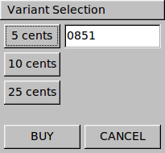

# Compiling the Paystation GUI

The GUI uses the Fast Light Toolkit library available under the Gnu-GPL license at
http://www.fltk.org/

The code was tested on both Linux version 2.6.32 and Mac OSX 10.6. 



A) The Mac OS build system assumes FLTK is installed in the system
wide directories, for ex: /usr/local/include for the headers and
/usr/local/lib for the libraries.

B) On the CS Lab network, the FLTK library is installed in 
/home/lib2720/lect/fltk-1.3.0
I hope that the permissions are set up correctly so that you can build
the executables on the school network. If you have issues, please let me
know. 

C) To build the project on a different platform than at school, please
download FLTK and follow installation instructions. Configure the
Makefile in src/view subdirectory and specify the following:
  1) the location of the fltk include directories
  2) the location of the fltk library
  3) any other necessary options for compiling and linking can be
	obtained by running:
```
    fltk-config --cxxflags  
    fltk-config --ldflags
```
  from the FLTK install directory.
